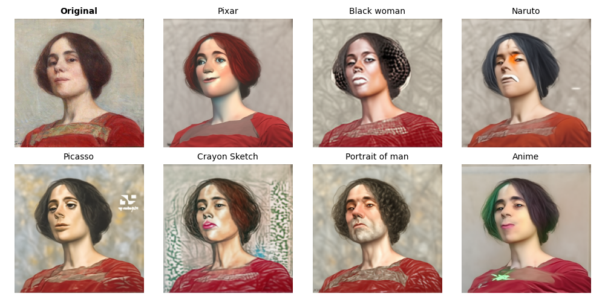
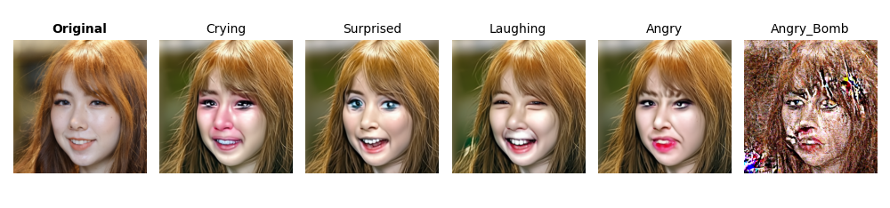

<h1 align="center">
Style Transfer for Image
</h1>

Source code for StyleTransfer4Image, where we attempt to do multiple applications based on diffusion models.

<!-- 
Group Member: 
<a href="https://github.com/Kr-Panghu">YuxiaoYang</a> 
<a href="https://github.com/Kr-Panghu">TianyuZhang</a>
<a href="https://github.com/Kr-Panghu">ZiqiHuang</a>
<a href="https://github.com/Kr-Panghu">ShuzeChen</a>
<a href="https://github.com/Kr-Panghu">Kr.Cen</a>

 -->

---

## Generate Samples with Diffusion

Here we trained [improved-diffusion](https://github.com/openai/improved-diffusion) models on 22000 pictures from [ffhq_dataset_thumbnails128x128](https://github.com/NVlabs/ffhq-dataset). By leveraging diffusion model, we are able to sample mutiple generated faces with good quality.

The following figures are some random-picked samples.

---

## CLIP-Based Style Transfer

> Implementation of Zero-Shot Contrastive Loss for Text-Guided Diffusion Image Style Transfer.

### Zero-Shot Contrastive Loss for Text-Guided Diffusion Image Style Transfer (ICCV 2023 Accepted)

 
#### [Paper](https://arxiv.org/pdf/2303.08622.pdf)&ensp;&ensp;&ensp; [Project Page](https://github.com/YSerin/ZeCon)

In these images, we show the results of generating multiple styles using pre-trained [CLIP](https://github.com/openai/CLIP) models and diffusion models. These styles include different facial expressions, artistic styles, etc. By leveraging diffusion model, we are able to generate multiple different styles in one run without the need to re-train the model or change parameters.

Additionally, we are able to control facial expression.

---

## Image-2-Image Style Transfer

To be determined.

---

## TBD

TBD